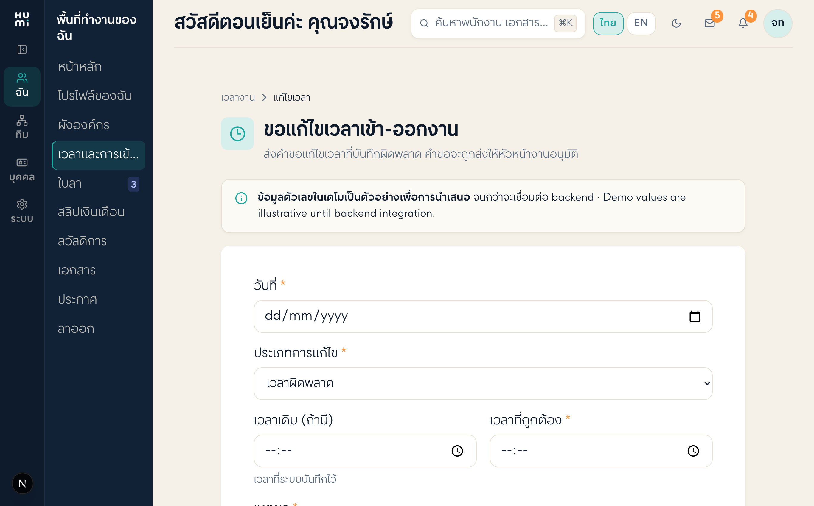

# บท 01 — ตั้งเครื่องมือและรันระบบขึ้นมาดู

> เป้าหมาย: เปิดระบบให้รันบนเครื่อง แล้วเห็นมันบนเบราว์เซอร์ที่ `http://localhost:3000`
> ทำตามทีละขั้น พิมพ์คำสั่งตามได้เลย

---

## 1. เครื่องมือที่ต้องมี (ติดตั้งครั้งเดียว)

> 💡 คำสั่งเช็คด้านล่าง "พิมพ์ในเทอร์มินัล" — ถ้ายังไม่รู้จักเทอร์มินัล ดู **ข้อ 2 ด้านล่างก่อน** ว่าเปิดยังไง

| เครื่องมือ | ใช้ทำอะไร | เช็คว่ามีไหม (พิมพ์ในเทอร์มินัล) |
|-----------|-----------|--------------------------------|
| **Node.js** (เวอร์ชัน 20 ขึ้นไป) | ตัวรันโค้ด JavaScript/TypeScript | `node -v` → ควรขึ้น `v20.x` หรือสูงกว่า |
| **npm** | ตัวจัดการ "ไลบรารี" (โค้ดของคนอื่นที่เรายืมใช้) | `npm -v` |
| **Git** | ตัวบันทึก/ย้อนประวัติโค้ด | `git -v` |
| **เอดิเตอร์** เช่น VS Code | ที่เปิด/แก้ไฟล์โค้ด | เปิดโปรแกรมดู |

> ถ้า `node -v` ไม่ขึ้นเลข แปลว่ายังไม่มี Node — โหลดจาก https://nodejs.org (เลือก LTS)
> ถ้า `git -v` ไม่ขึ้น — บน Mac พิมพ์ `xcode-select --install` (เด้งหน้าต่างให้ติดตั้ง git) หรือโหลดจาก https://git-scm.com

---

## 2. "เทอร์มินัล" คืออะไร

เทอร์มินัล (Terminal) = ช่องพิมพ์คำสั่งคุยกับเครื่องโดยตรง (จอดำๆ)
บน Mac เปิดได้จาก Spotlight พิมพ์ "Terminal"
ใน VS Code เปิดจากเมนู `Terminal → New Terminal`

คำสั่งที่ใช้บ่อยมาก:
```bash
cd <ชื่อโฟลเดอร์>     # เดินเข้าไปในโฟลเดอร์ (change directory)
ls                    # ดูว่ามีไฟล์อะไรในโฟลเดอร์นี้บ้าง
pwd                   # ดูว่าตอนนี้เราอยู่โฟลเดอร์ไหน
```

---

## 3. ขั้นตอนรันระบบ (ทำทุกครั้งที่อยากเปิดดู)

### ครั้งแรกสุด (ติดตั้งไลบรารีก่อน — ทำครั้งเดียว)

```bash
cd ~/Projects/hr/src/frontend     # เดินเข้าโฟลเดอร์โค้ดจริง
npm install                       # โหลดไลบรารีทั้งหมด (รอ 1-3 นาที ทำครั้งเดียวพอ)
```

> `npm install` จะสร้างโฟลเดอร์ `node_modules/` (ใหญ่มาก เก็บโค้ดที่เรายืมใช้)
> ถ้าเห็นโฟลเดอร์นี้อยู่แล้ว = เคยติดตั้งแล้ว ข้ามขั้นนี้ได้
> 🟡 ระหว่างติดตั้งจะมีข้อความเลื่อนพรืดเต็มจอ + คำเตือนสีเหลือง (`warn`) — **เป็นเรื่องปกติ ไม่ใช่ error**
> รอจนขึ้นบรรทัดสรุป (เช่น `added NNN packages`) แล้วเทอร์มินัลกลับมาให้พิมพ์ได้ = เสร็จ

### ทุกครั้งที่จะเปิดดู

```bash
cd ~/Projects/hr/src/frontend
npm run dev                       # สตาร์ตเซิร์ฟเวอร์สำหรับพัฒนา
```

จะเห็นข้อความประมาณ:
```
▲ Next.js 16.x
- Local:  http://localhost:3000
✓ Ready
```

เปิดเบราว์เซอร์ไปที่ **http://localhost:3000** → มันจะเด้งไป `http://localhost:3000/th` (ภาษาไทย)
ภาษาอังกฤษคือ **http://localhost:3000/en**

> 🟢 ตอนนี้ระบบรันอยู่! ปล่อยเทอร์มินัลนี้เปิดทิ้งไว้ อย่าปิด
> ถ้าจะหยุด: กลับไปที่เทอร์มินัล กด `Ctrl + C`

### 🎯 แบบฝึกแรก: ล็อกอินเป็น "ตัวเคนเอง"

ในเดโมมีบัญชีของเคนอยู่แล้ว (สิทธิ์ HR Admin):
- อีเมล: **`ken@humi.test`**
- รหัส: **`ken2026`**

หน้าล็อกอินจะหน้าตาแบบนี้ (พิมพ์อีเมล/รหัสข้างบนในช่องขวา แล้วกด "เข้าสู่ระบบ"):


ลองเลย:
1. เปิด `http://localhost:3000/th` → ระบบพาไปหน้าล็อกอิน ใส่อีเมล/รหัสข้างบน
   (ถ้าเข้าหน้าแรกเลยไม่เจอหน้าล็อกอิน = เคยล็อกอินค้างไว้แล้ว ใช้ต่อได้เลย)
2. กดเล่นไปทั่ว — เมนูซ้าย, หน้าโปรไฟล์, หน้าอนุมัติงาน `/quick-approve`
3. สลับภาษาเป็นอังกฤษ: เปลี่ยน `/th` เป็น `/en` บน URL
4. ลองปุ่มสลับ persona (มุมขวาบน) ดูระบบในมุมหัวหน้า/พนักงาน

> นี่คือ "บัญชีของเคนเอง" — กดดูให้คุ้น ระบบพังยาก ลองได้เต็มที่
> (บัญชีเดโมอื่นๆ ดูได้ที่ `src/lib/demo-users.ts`)

เมื่อล็อกอินสำเร็จ จะเห็นหน้าแรกแบบนี้ — ซ้ายคือ **เมนู (sidebar)** บนคือ **แถบหัว (topbar)** กลางคือเนื้อหา:


มุมขวาบนของแถบหัว มีปุ่มที่ใช้บ่อย: สลับภาษา **ไทย/EN**, กระดิ่งแจ้งเตือน, และ **ปุ่มสลับ persona** (วงกลมตัวอักษรขวาสุด — กดเพื่อมองระบบในมุมหัวหน้า/พนักงาน):


---

## 4. "Hot Reload" — แก้โค้ดแล้วเห็นผลทันที

ระหว่าง `npm run dev` รันอยู่ ถ้าเราแก้ไฟล์โค้ดแล้วเซฟ
เบราว์เซอร์จะ **อัปเดตเองอัตโนมัติ** ภายในไม่กี่วินาที (ไม่ต้องรันใหม่)

เราจะลองแก้หน้านี้ (หน้า "ขอแก้ไขเวลาเข้า-ออกงาน") — สังเกตหัวข้อด้านบน:



ลองเลย:
1. เปิดไฟล์ `src/app/[locale]/time/corrections/page.tsx`
2. หาบรรทัดข้อความหัวข้อ `'ขอแก้ไขเวลาเข้า-ออกงาน'`
3. แก้เป็น `'ทดสอบแก้ข้อความ'` แล้วเซฟ
4. ดูเบราว์เซอร์ที่ `http://localhost:3000/th/time/corrections` → เปลี่ยนทันที!
5. แก้กลับเป็นเหมือนเดิม (อย่าลืม)

> นี่คือวิธีทำงานหลัก: แก้ → เซฟ → ดูผลบนเบราว์เซอร์ → แก้ต่อ

---

## 5. คำสั่งสำคัญทั้งหมด (อ้างอิงไว้)

รันจากในโฟลเดอร์ `src/frontend/` เสมอ:

```bash
npm run dev          # รันเซิร์ฟเวอร์ดูระบบ (ใช้บ่อยสุด)
npm run build        # สร้างเวอร์ชันจริง + เช็คว่าโค้ดไม่มี error (ด่านสำคัญก่อนส่งงาน)
npm test             # รันชุดทดสอบอัตโนมัติ (บท 09)
npm run lint         # ตรวจสไตล์โค้ดบางไฟล์
```

> ⚠️ ถ้า `npm run dev` แล้วขึ้น `port 3000 already in use` แปลว่ามันรันอยู่แล้วในอีกหน้าต่าง
> ไม่ต้องรันซ้ำ แค่เปิดเบราว์เซอร์ไป localhost:3000 ได้เลย

---

## 6. ปัญหาที่เจอบ่อยตอนรัน

| อาการ | สาเหตุ | วิธีแก้ |
|-------|--------|---------|
| `command not found: npm` | ยังไม่มี Node.js | ติดตั้ง Node (ข้อ 1) |
| `port 3000 already in use` | รันอยู่แล้ว | เปิดเบราว์เซอร์ไป localhost:3000 ตรงๆ |
| แก้โค้ดแล้วเบราว์เซอร์ไม่เปลี่ยน | แคชค้าง | เซฟไฟล์ซ้ำ 1 ครั้ง / กด `Cmd+Shift+R` ที่เบราว์เซอร์ (ดูบท 11) |
| `npm install` ค้างนาน | เน็ตช้า | รอ หรือกด Ctrl+C แล้วลองใหม่ |

---

## สรุปบทนี้

- รันระบบ: `cd ~/Projects/hr/src/frontend` แล้ว `npm run dev` → เปิด `localhost:3000/th`
- แก้โค้ด → เซฟ → เบราว์เซอร์เปลี่ยนเอง (hot reload)
- ก่อนส่งงานต้องผ่าน `npm run build` (จำไว้ — ด่านสำคัญ)

**ต่อไป →** [บท 02: พื้นฐาน TypeScript + React](./02-typescript-react-basics.md)
